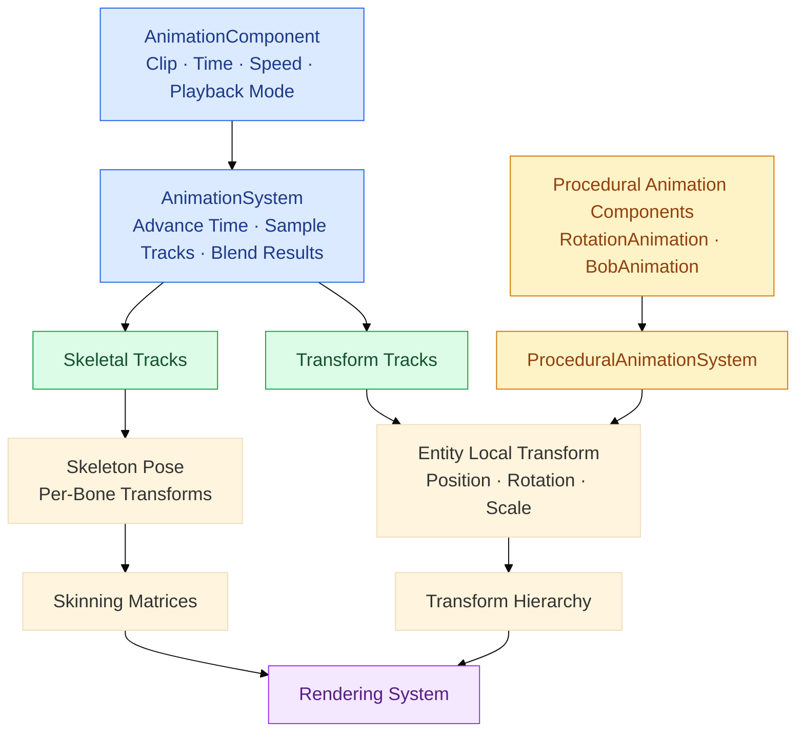

<h2>Animation system (WIP)

<h3>Flowchart:</h3>

```mermaid
 flowchart TD

%%{init: {
  "theme": "base",
  "themeVariables": {
    "fontSize": "18px"
  },
  "flowchart": {
    "nodeSpacing": 20,
    "rankSpacing": 35
  }
}}%%

AC["AnimationComponent<br/>Clip · Time · Speed · Playback Mode"]
AS["AnimationSystem<br/>Advance Time · Sample Tracks · Blend Results"]
AC --> AS
AS --> TT["Transform Tracks"]
AS --> ST["Skeletal Tracks"]
TT --> ET["Entity Local Transform<br/>Position · Rotation · Scale"]
ST --> SP["Skeleton Pose<br/>Per-Bone Transforms"]
ET --> TR["Transform Hierarchy"]
SP --> SM["Skinning Matrices"]
TR --> R["Rendering System"]
SM --> R
PA["Procedural Animation Components<br/>RotationAnimation · BobAnimation"]
PAS["ProceduralAnimationSystem"]
PA --> PAS
PAS --> ET
style AC fill:#dbeafe,stroke:#2563eb,color:#1e3a8a
style AS fill:#dbeafe,stroke:#2563eb,color:#1e3a8a
style TT fill:#dcfce7,stroke:#16a34a,color:#14532d
style ST fill:#dcfce7,stroke:#16a34a,color:#14532d
style PA fill:#fef3c7,stroke:#d97706,color:#92400e
style PAS fill:#fef3c7,stroke:#d97706,color:#92400e
style R fill:#f3e8ff,stroke:#9333ea,color:#581c87
```
