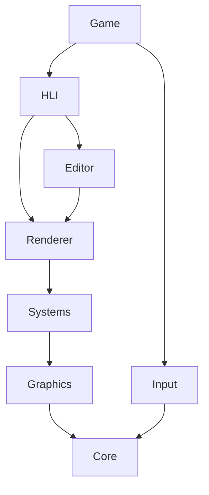

<div align="center">

  
# `cyb-engine`
  


[](https://opensource.org/licenses/MIT)

<p class="align center">
<h4><code>cyb-engine</code> is an open-source, easy to use and easy to modify 3d-engine</h4>
</p>
</div>

## Getting started...
Run the following commands to clone the git repository and generate project files
for visual studio 2022
```bash
git clone https://github.com/qbic/cyb-engine
cd cyb-engine && tools\generate-project-files.bat
```

## Dependency graph
